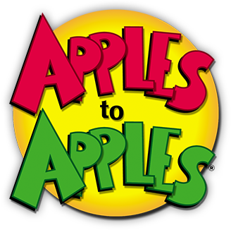

The popular social game brought to mobile on iOS. My role on the project was technical lead where I managed an internal team of 5 developers. My duties ranged from task breakdown and sprint planning to assisting developers in triaging blocking issues. The project had its technical challenges as it was the first project in house to use the Unity game engine. We decided to use the [Strange IoC](https://strangeioc.github.io/strangeioc/) to have a consistent development flow while giving us good constraints. A big challenge was supporting real time multiplayer and was achieved by using [Photon](https://www.photonengine.com/pun). In the end we achieved our goals and released a stable product which felt great!

 
 

`youtube: https://www.youtube.com/watch?v=fhtUYkDY-gQ`