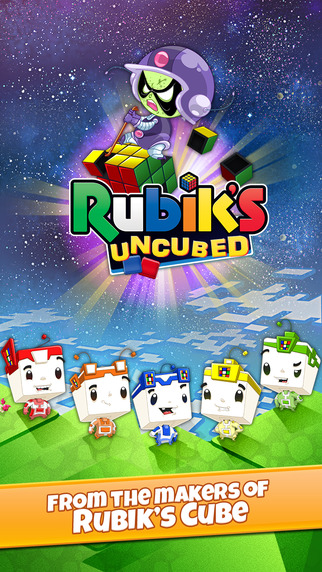

A match 3 game where gameplay involves meeting objectives by matching tiles in different formations. My contributions to the project were the following:
```
• Dynamic store front including in app purchasing.
• Integration with Facebook.
• Client SDK to communicate with the Magmic in-house servers. The SDK was used across multiple projects.
• Leaderboards.
• Content download system.
```
[Trailer](https://www.facebook.com/RubiksUncubed/videos/1521018274865629/)

---



</br>


</br>


</br>

