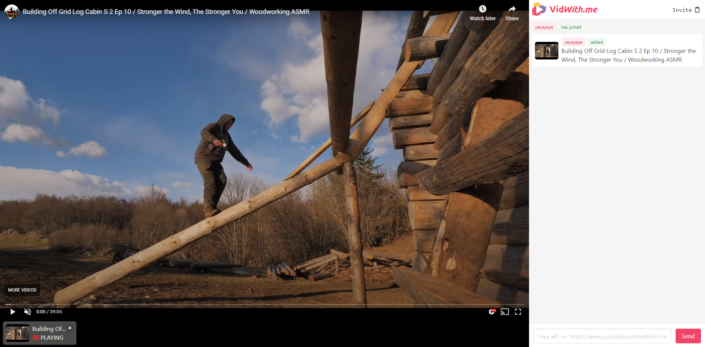

Wanting to stay connected with friends I developed a group video streaming website as a personal project with the goal of learning full stack development and watching videos in sync with others. I wrote the front and back end systems managing user sessions, rooms, chat and video syncing and state. Users can create a room and invite others and start watching videos together. [VidWith.me](https://vidwithme-2.herokuapp.com/)

---

